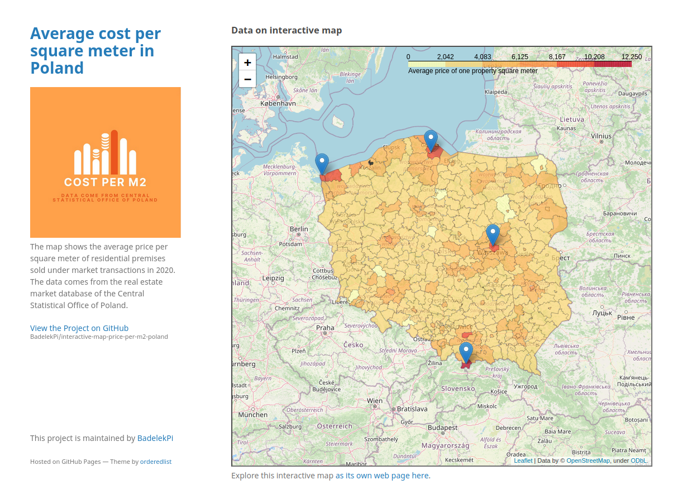

# interactive-map-price-per-m2-poland

Using Folium map to present GitHub Pages site.

Presenting average cost per square meter of real estate in Poland. The map was divided into counties.

Visit website here:[https://badelekpi.github.io/interactive-map-price-per-m2-poland/](https://badelekpi.github.io/interactive-map-price-per-m2-poland/)

